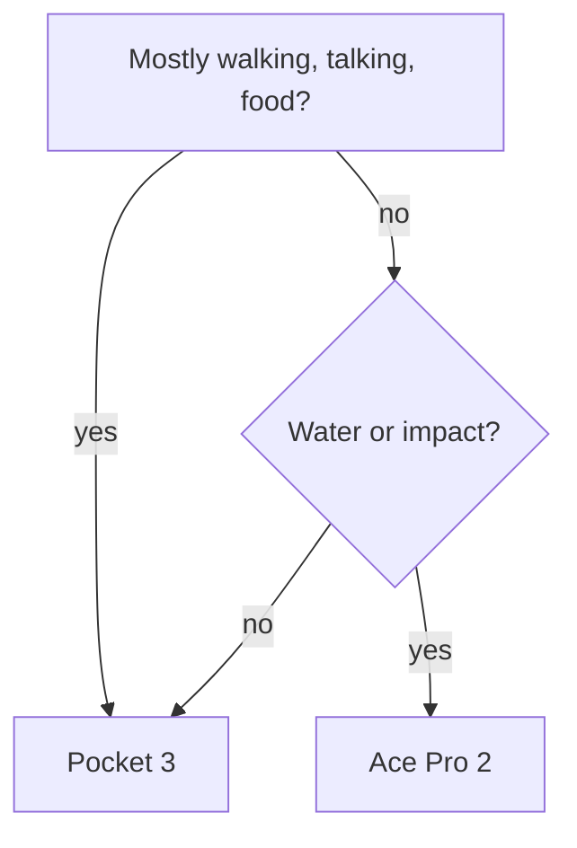

**Short version:** the Osmo Pocket 3 is the better travel camera for most people; the Insta360 Ace Pro 2 wins only if you mostly shoot action or in the rain.

## How they compare

| | Osmo Pocket 3 | Ace Pro 2 |
|---|---|---|
| Sensor | 1-inch | 1/1.3-inch |
| Stabilisation | 3-axis gimbal | Electronic |
| Waterproof | No | 12 m |
| Street price | $519 | $399 |

```chart
{"type":"bar","title":"Street price, USD","unit":"$","series":[{"name":"Body only","values":[{"x":"Pocket 3","y":519},{"x":"Ace Pro 2","y":399}]},{"name":"Creator kit","values":[{"x":"Pocket 3","y":669},{"x":"Ace Pro 2","y":499}]}]}
```

## Which one to buy



- [x] Both shoot 4K60 with log profiles.
- [ ] Neither replaces a phone for stills.

Sources: https://www.dji.com/osmo-pocket-3 https://www.insta360.com/product/insta360-ace-pro-2

```answer
{"summary":"Pocket 3 for travel vlogs, Ace Pro 2 for action and rain.","category":"tech","entities":[{"kind":"product","name":"DJI Osmo Pocket 3","attributes":{"price":"$519"},"url":"https://www.dji.com/osmo-pocket-3","confidence":0.9},{"kind":"product","name":"Insta360 Ace Pro 2","attributes":{"price":"$399"},"url":"https://www.insta360.com/product/insta360-ace-pro-2","confidence":0.9}],"claims":[{"claim":"The Pocket 3 has a 1-inch sensor.","verdict":"true","confidence":0.95,"sources":["https://www.dji.com/osmo-pocket-3"]}],"recommendations":["Buy the Pocket 3 creator kit if you record talking-head clips."],"tags":["camera","travel","vlog"]}
```
